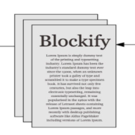

<h1>
<p align="center">
  
  <br>Blockify
</h1>
  <p align="center">
    Take back the ownership of your social content on-chain, and generate a passive income! :)
    <br />
    </p>
</p>
</br>
</br>

## About The Project

Blockify is a decentralised Platform as a Service, for creating fully decentralised blogs, and gives ownership only to the creator. In this way, you can be sure that you will not lose your conent, even if the application ever goes down still the data will be persisted on the blockchain, Ceramic Protocol, and IPFS. Moreover, to help creators create a passive income from their posts, and incentivize users to use the platform, some actions require pay in Blockify Tokens that are of ERC-20 standard. In this way, the platform can easily generate income for all, maintainers, creators, and even followers. However, to read the blogs, posts, and comments, there is no need to register, pay, or even have a crypto wallet.

The platform works in the following way:

1. Creator pays Blockify Tokens to mint his Blog NFT and starts creating posts
2. From that moment, there is no need to pay anything not even gas fees by the creator
3. Readers can easily reach the content, just by entering the app and reading all of the content
4. To interact with the given creator, the blog has to be followed and for that particular action payment in Blockify tokens is required
5. At the time when someone follows the creator, the tokens are being distributed among the Creator, platform maintainers and even the followers of the given blog
6. The same applied to comment logic, to comment user has to firstly follow the given Blog
7. In this way, there is a passive income guaranteed for every side - Maintainers, Creators, and Followers
## Tech stack

The smart contracts are built with Solidity and deployed to the Polygon Mumbai network, later on, The Graph is used to query the data from the blockchain. To store publications, Ceramic Protocol is used as it also provided a decentralised way to store data, plus there is no gas fee required, and it's also faster. Since the publications are stored on Ceramic Protocol which is Blockchain agnostic, in case of moving the platform to any other chain, the publications will be preserved.

### Built With

- [Hardhat](https://hardhat.org/)
- [Solidity](https://docs.soliditylang.org/en/v0.8.11/)
- [Alchemy](https://www.alchemy.com/)
- [React](https://reactjs.org/)

### Prerequisites

- [Node.js](https://nodejs.org/en/download/)
- [Metmask](https://metamask.io/)

### Installation

1. Install all the dependencies - `yarn`

2. Create an account on Alchemy, then create a new app and select "Polygon Mumbai" as a network.

3. Create a `.env` file in the root folder and add the
   following variables:

```
   API_URL=<ALCHEMY_API_URL>
   API_KEY=<THE_LAST_PART OF_THE_API_URL>
   PRIVATE_KEY=<YOUR_WALLET'S_PRIVATE_KEY>
   CONTRACT_ADDRESS=<DEPOLOYED_TOKEN_ADDRESS>
   POLYGONSCAN_API_KEY=<POLYGONSCAN_API_KEY>
```

Hint: You can get your own API key in the alchemy dashboard. The last part can be added after deploying the token.

### Compiling the Contract

run `npx hardhat compile` command.

### Deploying Smart Contract

1. Run `npx hardhat run scripts/deployBlockifyToken.ts --network mumbai` command, to deploy Token's contract
2. Run `npx hardhat run scripts/deployBlockify.ts --network mumbai` command, to deploy Blockify
3. Run `npx hardhat verify "<Blockify_Token_Address>" --network mumbai` command, to verify Blockify Token contract
4. Run `npx hardhat verify "<Blockify_Address>" --network mumbai` command, to verify Blockify contract

### The Graph API

1. Run `graph init --index-events` command in the empty folder to create the Graph API
2. Enter all of the realted info
3. Run `yarn codegen` to generate schemas
4. Add `startBlock` value to `subgraph.yaml` file
5. Run `graph auth` to add The Graph deploy key
6. Change `undefined` folder name inside of `generated` to `Blockify`
4. Run `yarn deploy` to deploy the graph

### Frontend

1. Add both BlockifyToken and Blockify abi files to the `abi` folder
2. Add deployed contracts address to the file inside of `consts` folder
3. Create `.env` and add `REACT_APP_WEB3_STORAGE=<WEB3_STORAGE_API_KEY>`
4. Run `yarn start` to start the project

### Live Preview

[Blockify](https://blockify.netlify.app/)
